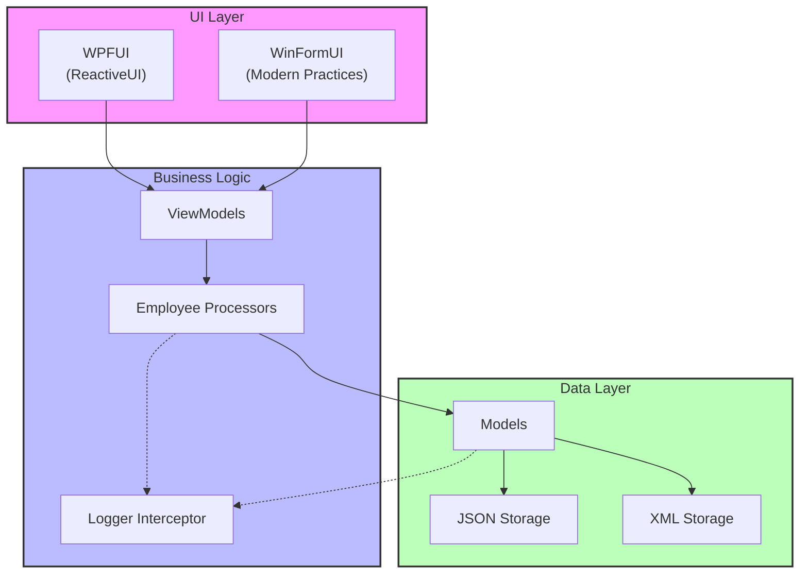
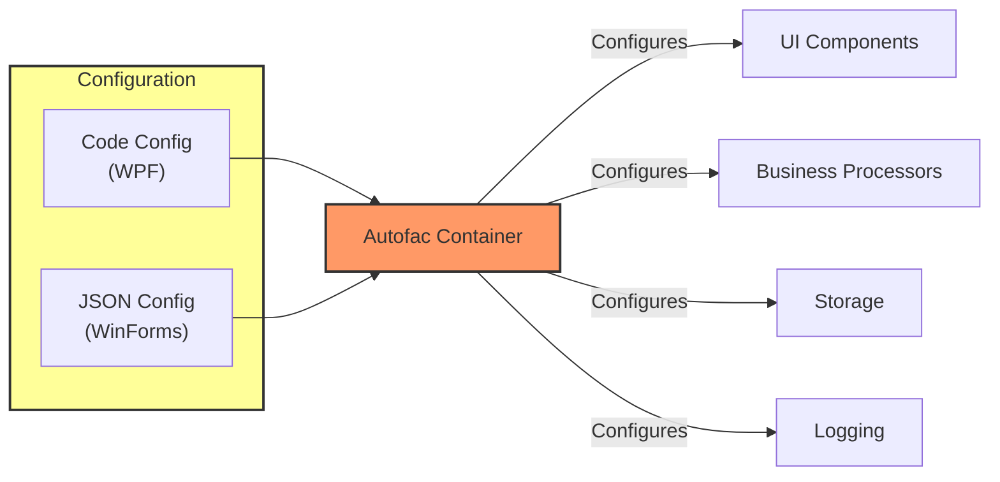
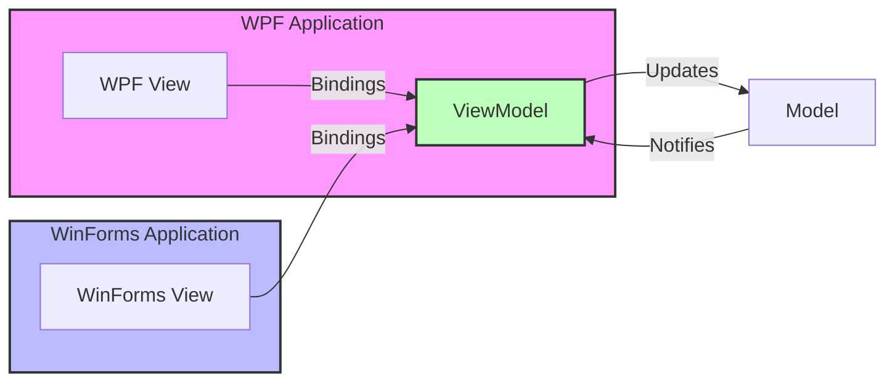

# DRY Demo - Modern Architecture with .NET Framework

This repository demonstrates how to implement modern software architecture and design patterns using .NET Framework 4.7, WinForms, and WPF. It serves as a proof of concept that legacy frameworks can support clean, maintainable, and extensible code design.

## Project Overview

The project showcases various modern software development practices and patterns:

- **Multiple UI Frameworks**: Both WinForms and WPF implementations sharing the same business logic
- **MVVM Pattern**: Clean separation of concerns with ViewModels shared between UI frameworks
- **Dependency Injection**: Using Autofac for flexible configuration and loose coupling
- **Multiple Storage Options**: Configurable storage mechanisms (JSON/XML)
- **Advanced Logging**: Cross-cutting logging implementation using interceptors
- **Clean Architecture**: Interface-based design with proper separation of concerns

## Architecture Diagrams

### Component Architecture

### Dependency Injection Flow

### MVVM Implementation

## Project Structure

- **DRYDemoLibrary**: Core business logic and interfaces
- **ModelsLib**: Data models and storage implementations
- **WPFUI**: WPF implementation using ReactiveUI
- **WinFormUI**: WinForms implementation with modern practices
- **DryDemoLibraryTest**: Unit tests for the business logic

## Key Features

### 1. Flexible Configuration
- Configure application behavior through code or JSON
- Swap between different storage mechanisms
- Choose between multiple UI implementations
- Configure logging behavior

### 2. Advanced Logging
- Logging through interceptors using Autofac.Extras.DynamicProxy
- Multiple logger implementations (Console, File)
- Configurable logging behavior per component

### 3. Storage Options
- JSON file storage
- XML file storage
- Easily extendable for new storage types

### 4. Modern UI Implementations
- WPF with ReactiveUI
- WinForms with modern practices
- Shared ViewModels between frameworks
- Clean separation of UI and business logic

## Getting Started

1. Clone the repository
2. Open the solution in Visual Studio
3. Build the solution
4. Choose either the WinForms or WPF project as your startup project
5. Run the application

## Configuration

The application can be configured through:
- Code-based configuration in the respective UI projects
- JSON configuration file for the WinForms application
- XML configuration options available

## Architecture Highlights

- **SOLID Principles**: The project strictly follows SOLID design principles
- **DRY (Don't Repeat Yourself)**: Common logic is shared across implementations
- **Interface-Based Design**: All major components are interface-based for flexibility
- **Cross-Cutting Concerns**: Handled elegantly through interceptors
- **Clean Architecture**: Proper separation of concerns and dependencies

## Future Enhancements

- Convert Views to reusable controls
- Implement master-detail content views
- Modern UI design updates for both frameworks
- Additional UI framework implementations
- Continuous documentation improvements

## Contributing

Feel free to contribute to this project by:
- Submitting bug reports
- Proposing new features
- Creating pull requests
- Improving documentation

## Acknowledgments

Special thanks to [Tim Corey](https://www.iamtimcorey.com/) for the initial inspiration through his DRY demo video.

## License

This project is open source and available under the MIT License.
